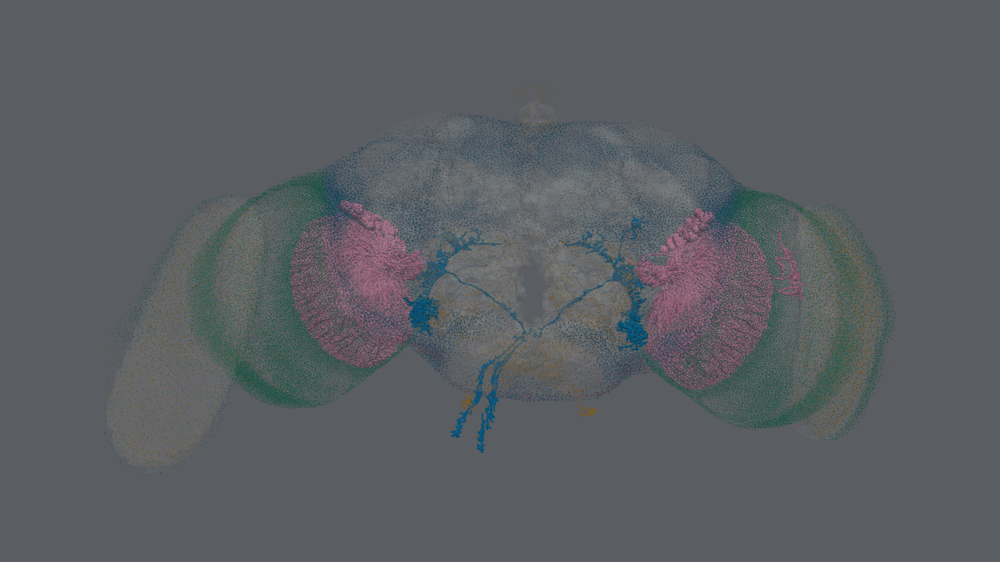

# ConnectomeKG

**Connectomes as knowledge graphs.**

*Eric G. Suchanek, PhD -- Flux-Frontiers*

ConnectomeKG turns an electron-microscopy connectome into a queryable
knowledge graph. Every neuron is a node, and every edge between two neurons
carries a synapse count and a transmitter sign. Cell types, neuropils,
taxonomy, hemilineages and community labels sit on top. The first corpus is
the FlyWire FAFB v783 adult *Drosophila* brain: 139,255 neurons and 3,732,460
connected neuron pairs.

**The whole fly brain, and where its signal goes.** Each sphere is one of the 79 neuropils, placed at the synapse-weighted centre of its neurons and coloured by brain region -- orange for the optic lobes down each side, yellow for the superior neuropils and lateral horn across the top, green for the antennal lobe and the neuropils around the oesophagus below, blue and light blue for the inferior, ventromedial and ventrolateral neuropils between them. A sphere's width grows with the cube root of its synapse count, so one twice as wide holds about eight times as many.

The tubes are the strongest 100 of 5,786 directed neuropil pairs. Thickness grows with the square root of the flow, and each tube bows to the right of its direction of travel, so a tube bulging toward you runs left to right. Flow is carried by neurons rather than counted from synapses: each neuron's output synapses in B, apportioned by the share of its input lying in A, summed over every neuron.

Behind them, one grey dot per neuron at its cell body -- all 139,255 of them, which is what gives the brain its outline. The floor and shadow carry no data; they are there for depth. One command draws it: `connkg quilt --view flow --floor --cloud --still`. Every mark is keyed in [Reading the images](rendering.md#flow-view).

*And one circuit inside it. Pink is LPLC2, the looming detectors filling the
lobula of each optic lobe; blue is DNp01, the giant fibre, which collects from
them and sends the two axons leaving the bottom of the frame down to the nerve
cord. One command draws it, over the same spec grammar the path and cone
queries take: `connkg quilt LPLC2 DNp01 --tubes --cloud`.*

!!! note "Data credit and licence"
    The images above are renders of the
    [FlyWire](https://flywire.ai) FAFB v783 connectome: Dorkenwald, S. et al.
    (2024), *Nature* 634, 124-138, and Schlegel, P. et al. (2024), *Nature*
    634, 139-152. The data is licensed under
    [CC BY-NC-SA 4.0](https://creativecommons.org/licenses/by-nc-sa/4.0/).
    The render is an adaptation of it, shared under the same licence, not
    under the software's Elastic License 2.0.

## Where to start

| page | covers |
|---|---|
| [Get the FAFB v783 data](DOWNLOAD.md) | The Codex files the build reads, and how to download and check them |
| [Rendering the connectome in 3-D](rendering.md) | `connkg quilt` and `connkg viz3d`: the circuit and flow views, how each is drawn, and Looking Glass quilts through [quiltwright](https://flux-frontiers.github.io/quiltwright/) |
| [Scene API](api/scene.md) | `build_brain_scene`, `neuropil_flow` and the rest of `connectomekg.scene` |
| [Skeleton API](api/skeletons.md) | Reading, writing and simplifying SWC skeletons |

The [README](https://github.com/Flux-Frontiers/connectome_kg#readme) covers
installation, the build, and every `connkg` command.
