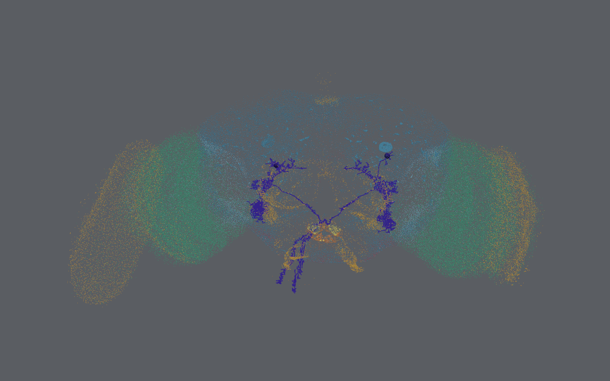
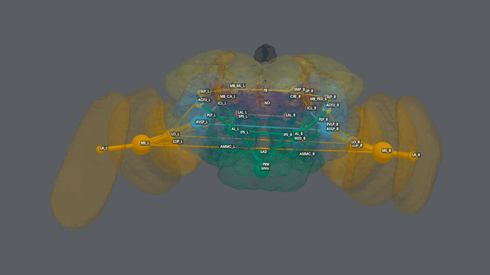
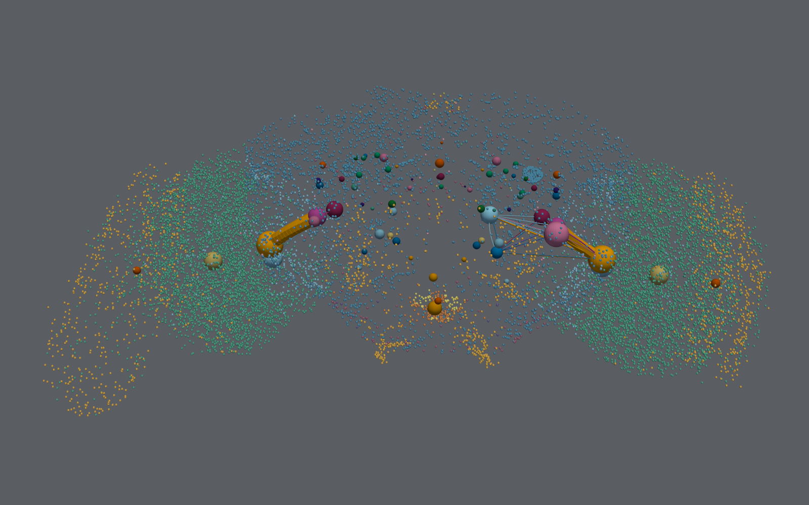
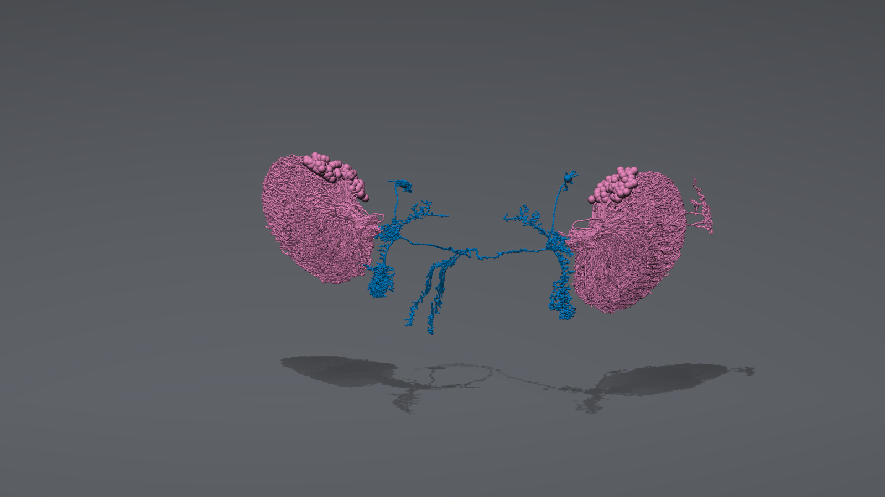

# Rendering the connectome in 3-D

`connkg quilt` and `connkg viz3d` draw a connectome where it is: every neuron
at its real position in the brain. Other 3-D views in the KGRAG fleet grow
an invented tree layout. A connectome does not need one, because the
microscope already put every neuron somewhere.

Two views are available:

- **Circuit** (`--view circuit`, the default) draws the traced skeletons of
  the neurons that one or more SPECs resolve to.
- **Flow** (`--view flow`) draws neuropils as spheres, linked by tubes
  weighted by how much signal the brain's neurons carry between them.

Both views draw the whole brain as a context cloud behind the subject, and,
once fetched with `connkg meshes`, the brain's neuropils as faint surfaces.
Both render either as a Looking Glass quilt or in an interactive viewer.



*Circuit view: the two DNp01 giant fiber neurons, drawn from their traced
skeletons, inside the FAFB v783 context cloud. See
[Reading the images](#reading-the-images).*



*Flow view: the strongest 100 of 5,786 directed neuropil pairs, with each
neuropil labelled. See [Reading the images](#reading-the-images).*

!!! note "Data credit and licence"
    The images on this page are renders of the
    [FlyWire](https://flywire.ai) FAFB v783 connectome: Dorkenwald, S. et al.
    (2024), *Nature* 634, 124-138, and Schlegel, P. et al. (2024), *Nature*
    634, 139-152. The data is licensed under
    [CC BY-NC-SA 4.0](https://creativecommons.org/licenses/by-nc-sa/4.0/).
    The renders are adaptations of it, shared under the same licence, not
    under the software's Elastic License 2.0.

## Reading the images

Every image on this page has the same three layers: a grey background, the
context cloud, and the subject of the view. The keys below give what each
colour, shape and size means.

Region and cell-type colours are the saturated Okabe-Ito colours, which stay
distinguishable under the common forms of colour blindness. The context cloud
uses saturated colours too (Okabe-Ito for most super classes, with a wine,
indigo and olive for the three smallest), muted part of the way toward the
grey background, so the subject of each view stands out from it. No colour is
a pastel, and shapes and labels back up colour wherever the distinction
matters.

### Background and context cloud

The background is a flat grey, <span class="swatch" style="background:#5A5D62"></span> `#5A5D62`. It carries no data.

Each small dot is one neuron, at its soma once `connkg skeletons` has
back-filled somas, and at its marked point otherwise.

In the **circuit view**, all 139,255 neurons are drawn, and a dot's colour is
the neuron's super class, muted toward the background (the swatches show the
colours as drawn):

| colour | super class | neurons in FAFB v783 |
|---|---|---|
| <span class="swatch" style="background:#28688E"></span> `#28688E` | `central` | 32,381 |
| <span class="swatch" style="background:#28806B"></span> `#28806B` | `optic` | 77,873 |
| <span class="swatch" style="background:#578CAC"></span> `#578CAC` | `visual_projection` | 7,684 |
| <span class="swatch" style="background:#986C87"></span> `#986C87` | `visual_centrifugal` | 522 |
| <span class="swatch" style="background:#A7812C"></span> `#A7812C` | `sensory` | 16,938 |
| <span class="swatch" style="background:#ACA750"></span> `#ACA750` | `sensory_ascending` | 612 |
| <span class="swatch" style="background:#9D5D2C"></span> `#9D5D2C` | `ascending` | 1,750 |
| <span class="swatch" style="background:#733C5A"></span> `#733C5A` | `descending` | 1,305 |
| <span class="swatch" style="background:#443C76"></span> `#443C76` | `motor` | 110 |
| <span class="swatch" style="background:#7C7E48"></span> `#7C7E48` | `endocrine` | 80 |

The broad regions of the brain follow from these colours. The two large
green masses are the optic lobes. The orange arcs outside them are sensory
neurons, which are mostly visual: 11,426 of the 16,938 sensory neurons. The
blue mass between the optic lobes is the central brain.

With `--color-by sign`, the dots are coloured by transmitter sign instead:
<span class="swatch" style="background:#96584D"></span> `#96584D` excitatory, <span class="swatch" style="background:#416683"></span> `#416683` inhibitory, and
<span class="swatch" style="background:#7D838A"></span> `#7D838A` unknown.

In the **flow view**, every 10th neuron is drawn and every dot is the same
grey, <span class="swatch" style="background:#74787E"></span> `#74787E`, whatever `--color-by` says. The cloud there
only outlines the brain, so that colour in the flow view means one thing: a
neuropil's brain region.

### Circuit view

| what you see | what it means |
|---|---|
| Branching lines in one colour | The traced skeleton of each neuron of one cell type. Every cell type has its own colour. |
| A sphere in the same colour, on the skeleton | That neuron's soma (cell body), or the skeleton's root point if the skeleton has no soma. |
| A larger sphere in the same colour, away from any skeleton | A neuron with no skeleton file, drawn at its marked point. |
| Tubes instead of lines | The same skeletons, drawn with `--tubes`. |
| A floor and a shadow under the brain | `--floor`. The shadow shows depth. It carries no data. |

A cell type's colour is one of the seven non-black Okabe-Ito colours, fixed by
its name, so it is the same in every render. The colour identifies the type
within one image; it does not encode a category, and it can match a super
class colour in the cloud. In the images on this page, DNp01 is
<span class="swatch" style="background:#0072B2"></span> `#0072B2` and LPLC2 is <span class="swatch" style="background:#CC79A7"></span> `#CC79A7`.

### Flow view

| what you see | what it means |
|---|---|
| A large sphere with a label | A neuropil, placed at the synapse-weighted centre of its neurons. `_L` and `_R` mark the left and right hemisphere; a name with no suffix spans the midline. |
| Sphere colour | The neuropil's brain region (table below). |
| Sphere size | The neuropil's synapse count. Radius grows with the cube root, so a sphere twice as wide holds about eight times the synapses. |
| A tube between two spheres | Signal flow from one neuropil to the other, carried by neurons that take input in the first and make output in the second. See [What flow measures](#what-flow-measures). |
| Tube thickness | The amount of flow, relative to the strongest drawn tube. Radius grows with the square root, so a tube twice as thick carries about four times the flow. |
| Tube colour | The brain region of the source neuropil: the flow leaves a neuropil of that region. |
| Which way a tube curves | The direction of flow. Seen from above, every tube bows to the right of its direction of travel. In the front view, a tube running left to right bulges toward you and one running right to left bulges away. |
| A small, darker sphere with no label | A neuropil with no drawn tube, shown for context. |

Neuropils are grouped into brain regions after the systematic nomenclature
FlyWire's neuropils follow (Ito et al. 2014). There are 13 regions and 8
colours, so regions that neighbour each other in the brain share a colour:

| colour | regions and their neuropils |
|---|---|
| <span class="swatch" style="background:#E69F00"></span> `#E69F00` orange | optic lobe: `LA`, `ME`, `AME`, `LO`, `LOP` |
| <span class="swatch" style="background:#56B4E9"></span> `#56B4E9` sky blue | ventrolateral neuropils: `AOTU`, `AVLP`, `PVLP`, `PLP`, `WED` |
| <span class="swatch" style="background:#D55E00"></span> `#D55E00` vermillion | mushroom body: `MB_CA`, `MB_PED`, `MB_VL`, `MB_ML` |
| <span class="swatch" style="background:#CC79A7"></span> `#CC79A7` reddish purple | central complex: `FB`, `EB`, `PB`, `NO`; lateral complex: `BU`, `LAL`, `GA` |
| <span class="swatch" style="background:#F0E442"></span> `#F0E442` yellow | lateral horn: `LH`; superior neuropils: `SLP`, `SIP`, `SMP` |
| <span class="swatch" style="background:#0072B2"></span> `#0072B2` blue | inferior neuropils: `CRE`, `SCL`, `ICL`, `IB`, `ATL`; ventromedial neuropils: `VES`, `EPA`, `GOR`, `SPS`, `IPS` |
| <span class="swatch" style="background:#009E73"></span> `#009E73` bluish green | antennal lobe: `AL`; periesophageal neuropils: `SAD`, `AMMC`, `FLA`, `CAN`, `PRW`; gnathal ganglia: `GNG` |
| <span class="swatch" style="background:#000000"></span> `#000000` black | ocellar ganglion: `OCG`; unassigned: `UNASGD` |

`connkg quilt` and the viewer draw the spheres without labels, so use the
region colours there. The images on this page add labels, which tell apart
neuropils that share a colour.

??? note "Neuropil abbreviations in the images on this page"

    | label | neuropil | region | colour |
    |---|---|---|---|
    | `AL` | antennal lobe | antennal lobe | <span class="swatch" style="background:#009E73"></span> `#009E73` |
    | `AMMC` | antennal mechanosensory and motor center | periesophageal neuropils | <span class="swatch" style="background:#009E73"></span> `#009E73` |
    | `AOTU` | anterior optic tubercle | ventrolateral neuropils | <span class="swatch" style="background:#56B4E9"></span> `#56B4E9` |
    | `AVLP` | anterior ventrolateral protocerebrum | ventrolateral neuropils | <span class="swatch" style="background:#56B4E9"></span> `#56B4E9` |
    | `CRE` | crepine | inferior neuropils | <span class="swatch" style="background:#0072B2"></span> `#0072B2` |
    | `FB` | fan-shaped body | central complex | <span class="swatch" style="background:#CC79A7"></span> `#CC79A7` |
    | `GNG` | gnathal ganglia (subesophageal zone) | gnathal ganglia | <span class="swatch" style="background:#009E73"></span> `#009E73` |
    | `ICL` | inferior clamp | inferior neuropils | <span class="swatch" style="background:#0072B2"></span> `#0072B2` |
    | `IPS` | inferior posterior slope | ventromedial neuropils | <span class="swatch" style="background:#0072B2"></span> `#0072B2` |
    | `LA` | lamina | optic lobe | <span class="swatch" style="background:#E69F00"></span> `#E69F00` |
    | `LAL` | lateral accessory lobe | lateral complex | <span class="swatch" style="background:#CC79A7"></span> `#CC79A7` |
    | `LH` | lateral horn | lateral horn | <span class="swatch" style="background:#F0E442"></span> `#F0E442` |
    | `LO` | lobula | optic lobe | <span class="swatch" style="background:#E69F00"></span> `#E69F00` |
    | `LOP` | lobula plate | optic lobe | <span class="swatch" style="background:#E69F00"></span> `#E69F00` |
    | `MB_CA` | mushroom body calyx | mushroom body | <span class="swatch" style="background:#D55E00"></span> `#D55E00` |
    | `MB_ML` | mushroom body medial lobe | mushroom body | <span class="swatch" style="background:#D55E00"></span> `#D55E00` |
    | `MB_PED` | mushroom body pedunculus | mushroom body | <span class="swatch" style="background:#D55E00"></span> `#D55E00` |
    | `ME` | medulla | optic lobe | <span class="swatch" style="background:#E69F00"></span> `#E69F00` |
    | `NO` | noduli | central complex | <span class="swatch" style="background:#CC79A7"></span> `#CC79A7` |
    | `PLP` | posterior lateral protocerebrum | ventrolateral neuropils | <span class="swatch" style="background:#56B4E9"></span> `#56B4E9` |
    | `PRW` | prow | periesophageal neuropils | <span class="swatch" style="background:#009E73"></span> `#009E73` |
    | `PVLP` | posterior ventrolateral protocerebrum | ventrolateral neuropils | <span class="swatch" style="background:#56B4E9"></span> `#56B4E9` |
    | `SAD` | saddle | periesophageal neuropils | <span class="swatch" style="background:#009E73"></span> `#009E73` |
    | `SIP` | superior intermediate protocerebrum | superior neuropils | <span class="swatch" style="background:#F0E442"></span> `#F0E442` |
    | `SLP` | superior lateral protocerebrum | superior neuropils | <span class="swatch" style="background:#F0E442"></span> `#F0E442` |
    | `SMP` | superior medial protocerebrum | superior neuropils | <span class="swatch" style="background:#F0E442"></span> `#F0E442` |
    | `SPS` | superior posterior slope | ventromedial neuropils | <span class="swatch" style="background:#0072B2"></span> `#0072B2` |
    | `VES` | vest | ventromedial neuropils | <span class="swatch" style="background:#0072B2"></span> `#0072B2` |
    | `WED` | wedge | ventrolateral neuropils | <span class="swatch" style="background:#56B4E9"></span> `#56B4E9` |

## Quilts and Looking Glass displays

A Looking Glass display shows a 3-D scene without glasses. Lenticular optics
send a slightly different image toward each viewing angle, so each eye sees
the scene from its own position. The display plays a *quilt*: a single PNG
that tiles many renders of the same scene in a grid, one per camera
position.

ConnectomeKG does not build quilts itself. It composes a PyVista scene, and
[quiltwright](https://flux-frontiers.github.io/quiltwright/) renders that scene into a quilt, reports its depth
budget, and sends it to the display. For each view, quiltwright:

1. Starts from the scene's camera. The camera's focal point becomes the
   plane of the physical glass. ConnectomeKG places the focal plane inside
   the brain (see [Camera and framing](#camera-and-framing)), so nearer
   structures stand in front of the glass and farther ones sit behind it.
2. Slides the camera sideways across the display's view cone without
   turning it.
3. Renders with an off-axis (asymmetric-frustum) projection, which keeps the
   glass plane identical in every view. The display can only fuse views that
   share that plane. Turning each camera toward the subject ("toe-in")
   produces ghosting instead of depth.

The default preset, `16-landscape`, targets the 16-inch landscape display:
48 views in 8 columns and 6 rows, and a 7680 x 4320 quilt. The display
accepts a 50-degree view cone, but `connkg quilt` sweeps 35 degrees by
default (`--view-cone`), the same cap quiltwright's own CLI applies. View 0, the leftmost camera, is the bottom-left tile. The filename
suffix, for example `_qs8x6a1.77778`, records the columns, rows and aspect
ratio, so Looking Glass Bridge configures playback from the name.

A scene that is too deep for the display looks blurred at its front and
back. The *depth budget* is how far in front of and behind the glass plane a
scene can extend before that happens. `connkg quilt` checks it on every run
(see [World coordinates](#world-coordinates)).

For the full method, the other rendering backends, and Bridge setup, see the
[quiltwright documentation](https://flux-frontiers.github.io/quiltwright/), in particular
[the PyVista backend](https://flux-frontiers.github.io/quiltwright/lfd/).

## Before you begin

You need the following:

- The `viz3d` extra, which installs PyVista, PyQt5, pyvistaqt and
  [quiltwright](https://flux-frontiers.github.io/quiltwright/):

    ```bash
    pip install -e ".[viz3d]"      # or: poetry install --extras viz3d
    ```

- A built graph in `connectomes/<dataset>/.connectomekg/graph.sqlite`. See
  the README for `connkg build` and `--dataset`.
- For the circuit view, skeletons -- from either source, the cache first:
    - **The skeleton cache**, `.connectomekg/skeletons.parquet`, written once
      by `connkg skeletons --data-dir fafb_v783`. It holds every neuron's
      simplified skeleton and is about 3.5 GB, so a render needs neither the
      31 GB nor an SWC parse. See [The skeleton cache](#the-skeleton-cache).
    - **The skeleton download** in `fafb_v783/sk_lod1_783_healed/`, one `.swc`
      file per neuron, about 31 GB. Any neuron the cache does not hold is read
      from here when `--data-dir` is given.

    With neither, each circuit neuron is drawn as a sphere at its marked
    point. The flow view does not read skeletons.
- For the neuropil surfaces, the mesh cache. Fetch it once with
  `connkg meshes`, which downloads the 78 FAFB v783 neuropil meshes from
  FlyWire's public bucket (no sign-in, about 1 MB) into
  `connectomes/<dataset>/.connectomekg/neuropil_meshes.npz`. Without it,
  both views are drawn without surfaces. See [Neuropil meshes](#neuropil-meshes).

## Render a view

A SPEC is a cell type name (`LC4`), a root id, a neuron node id, or
`label:<regex>` over community labels. Specs are case-sensitive.

To open a view in the interactive viewer, run `connkg viz3d`:

```bash
connkg --root . viz3d LC4 DNp01                 # circuit: two cell types
connkg --root . viz3d --view flow               # flow: whole brain
connkg --root . viz3d --view flow LC4           # flow carried by LC4 only
```

Drag to orbit, scroll to zoom, and shift-drag to pan. To send the current
camera view to a Looking Glass display as a quilt, click **Cast to Looking
Glass**. Looking Glass Bridge must be running; see
[Set up Bridge and the display](https://flux-frontiers.github.io/quiltwright/lfd/#1-set-up-bridge-and-the-display).

To render a quilt without a window, run `connkg quilt`:

```bash
connkg --root . quilt DNp01 --preview dnp01.png
connkg --root . quilt --view flow --top 60 --floor --cast
```

To render one flat image instead of a quilt, add `--still`. The still is the
quilt's centre view at the preset's aspect, 3840 x 2160 for `16-landscape`:

```bash
connkg --root . quilt LPLC2 DNp01 --tubes --floor --still
```

`connkg quilt` prints what it drew and, for a quilt, a depth report. It then
writes files under `renders/`:

| path | contents |
|---|---|
| `renders/stills/` | a `--still` image, and the `--preview` PNG when the value is a bare filename |
| `renders/quilts/` | the quilt, named after the specs (`flow_LC4_qs8x6a1.77778.png` for a flow) |

Quilts are never committed.

### Options

| option | views | default | effect |
|---|---|---|---|
| `--view` | both | `circuit` | `circuit` or `flow` |
| `--color-by` | both | `super_class` | context cloud colour: `super_class` or `sign` |
| `--data-dir` | circuit | `fafb_v783` | skeleton download root |
| `--skeleton-step` | circuit | `4` | keep every Nth skeleton point, 1 to 50 |
| `--tubes` | circuit | off | draw skeletons as tubes instead of lines |
| `--top` | flow | `100` | strongest neuropil pairs drawn, 1 to 500 |
| `--neuropils` / `--no-neuropils` | both | on | draw the neuropil surfaces, when `connkg meshes` has fetched them |
| `--cloud` / `--no-cloud` | both | on, unless the surfaces are drawn | draw the context cloud |
| `--floor` | both | off | stand the scene over a floor lit from above, with shadows |
| `--elevation` | both | `25` with `--floor`, else `0` | degrees to tilt the camera up so it looks down, -80 to 80 |
| `--preset` | both | `16-landscape` | quiltwright quilt preset (8 x 6 views) |
| `--view-cone` | quilt | `35` | degrees the quilt cameras sweep |
| `--fov`, `--zoom` | quilt | `14.0`, `1.0` | per-view field of view in degrees, and camera dolly |
| `--still` | quilt | off | render one flat centre view instead of a quilt |
| `--cast` | quilt | off | send the finished quilt to Looking Glass Bridge; not with `--still` |

The circuit view needs at least one SPEC. In the flow view, SPECs are
optional.

## How a scene is built

Every render path calls one function,
`connectomekg.scene.build_brain_scene`. It composes the scene into a PyVista
plotter that the caller supplies. `connkg quilt` passes an off-screen
plotter, the viewer passes its Qt widget, and **Cast to Looking Glass**
rebuilds the scene in a fresh off-screen plotter. All three therefore draw
the same thing.

The function works in five steps:

1. Set the background to a muted grey (`scene.BACKGROUND`, `#5A5D62`).
2. Compute the world frame from the neuron positions.
3. Draw the neuropil meshes, when cached and `neuropils=True`.
4. Draw the context cloud, unless meshes were drawn (`cloud=None`, the
   default) or `cloud=False`.
5. Draw the circuit or the flow.

The module is split so most of it runs without PyVista. `world_frame`,
`context_points`, `circuit_neurons`, `neuropil_flow` and `flow_arc` are
NumPy and SQL only. The tests exercise them without the `viz3d` extra.

### Data each view reads

| data | source | read by |
|---|---|---|
| neuron positions | `soma_x`, `soma_y`, `soma_z` in each neuron node's metadata where `connkg skeletons` back-filled one, else `x`, `y`, `z`, the Codex marked point, in nm | world frame, context cloud, flow centroids |
| super class and sign | neuron node metadata | context cloud colour |
| skeletons | `.connectomekg/skeletons.parquet` (written by `connkg skeletons`), then `fafb_v783/sk_lod1_783_healed/<root_id>.swc` for whatever it does not hold | circuit |
| per-neuron neuropil synapse counts | `IN_NEUROPIL` edge evidence, `{"pre": n, "post": m}` | flow |
| neuropil synapse totals | neuropil node metadata, `n_synapses` | flow sphere size |
| neuropil surfaces | `.connectomekg/neuropil_meshes.npz`, written by `connkg meshes` | both |

## World coordinates

FAFB coordinates are image coordinates in nanometres: `x` runs across the
brain, `y` increases ventrally, and `z` runs through the section stack. The
3-D stack expects `+z` up.

`build_brain_scene` centres the scene on the median neuron position and
scales it to 1 world unit per 100,000 nm. It maps each point as follows:

```
world = ((x - cx) / S,  (z - cz) / S,  -(y - cy) / S)       S = 100,000 nm
```

Negating `y` puts dorsal up. At this scale the brain is about 8 x 4 x 3 world
units, which fits inside the depth budget of a Looking Glass quilt.

## Camera and framing

`connectomekg.scene.aim_camera` sets the camera in three steps:

1. `kg_utils.viz3d.frame_tree` points the camera along world `+y`, so you
   see the brain from the front with dorsal up.
2. With a non-zero `--elevation`, the camera tilts up by that many degrees
   and looks down on the brain.
3. `quiltwright.frame_and_focus` fits the scene tightly at that final
   direction and puts the focal plane at the harmonic mean of the scene's
   near and far depths. A tilted view framed by `reset_camera()` instead
   leaves the brain small in frame.

`frame_and_focus` fits to the window's shape, so `connkg quilt` sizes its
window to the aspect quiltwright captures each view at (16:9 for
`16-landscape`), not to the quilt tile (4:3). After framing, the camera is
fixed: the depth report and the render both take `fov=None`, so neither
re-frames it.

For a quilt, `connkg quilt` prints `quiltwright.depth_report` for that
camera and `--zoom`. The report lists how many pixels the nearest and
farthest geometry shift between neighbouring views. Around 4 to 5 px is the
practical ceiling, and rows above 5.5 px are flagged as soft. The flow view
with a floor comes to about 3.4 px at `--zoom 1.0` and about 3.7 px at
`--zoom 1.1`. Above about 1.15 the camera crops the optic lobes, because the
brain already spans the width of the frame.

## The context cloud

The context cloud draws each neuron as a small sphere. The cloud shows the
outline of the brain: optic lobes, central brain and the gaps between
regions.

Each sphere sits at the neuron's **soma** where the graph has one --
`soma_x`/`soma_y`/`soma_z`, written by `connkg skeletons` -- and at its
**marked point** otherwise. A graph without the back-fill draws the
marked-point cloud it always did. The scene's title says which: `somas=N`
once any of the dots is a real cell body, `context=N` while none is.

Three choices keep it visible without covering the subject:

- **Spheres sized in world units, not pixels.** A 2-pixel point disappears
  in a Retina window and in a quilt tile. A world-sized sphere scales with
  the camera like the rest of the scene. Each sphere is a low-poly glyph (6 x
  4 facets), so the full 139,255-neuron cloud is about 3.3 million triangles
  and composes in under a second.
- **Muted, opaque colours.** Each dot's colour from `connectomekg.colors`
  is blended 45% toward the grey background (`_CONTEXT_MUTE`). The hue stays,
  but the skeletons and neuropils drawn at full saturation stand out, even
  where a cell type shares a hue with the dots around it. The blend goes
  toward the background, not toward white, because lightened colours turn
  pastel and colour-blind readers cannot tell pastels apart. The dots are
  opaque, because alpha blending ghosts between views in a light-field
  render.
- **Thinner and grey in the flow view.** The flow view draws every 10th
  neuron, with larger spheres (radius 0.014 world units, against 0.005 in the
  circuit view), all in one neutral grey. At full density, the cloud hides
  the neuropil spheres inside it, and super-class colours would compete with
  the region colours.

[Background and context cloud](#background-and-context-cloud) lists every
colour.

A marked point is not a cell body: FlyWire's anchor can sit tens of microns
from the soma, so a cloud drawn from marked points shows where neurons are
rather than where their cell bodies are. `connkg skeletons` is what replaces
them -- see [The skeleton cache](#the-skeleton-cache).

## Neuropil meshes

The neuropil meshes are the surfaces of the volumes FlyWire used to assign
each v783 synapse to a neuropil: the JFRC2 template neuropils (Ito et al.
2014) mapped into FlyWire space. So a mesh encloses the synapses that the
graph's `IN_NEUROPIL` edges count for that neuropil. FlyWire publishes them
as Neuroglancer precomputed meshes at
`gs://flywire_neuropil_meshes/neuropils/neuropil_mesh_v141_v6`. That source
numbers the meshes 0 to 77 and does not name them.

`connectomekg.neuropil_meshes.FAFB_783_MESH_NAMES` names them. It was built
by matching every v6 mesh, vertex set for vertex set, against the named copy
fafbseg packages from the same source: all 78 match exactly, to 78 distinct
names. The one v783 neuropil without a mesh is `UNASGD`, the synapses no
volume claimed. fafbseg's `volume_name_dict.json` looks like the answer but
is not: it numbers the synapse-assignment volume, and matches none of these
meshes.

The views draw the meshes like this:

- **Circuit view:** pale neutral shells, `#C8CCD2` at 10% opacity, so the
  circuit's cell-type colours stay the only colour in the scene.
- **Flow view:** each surface tinted with its brain region's colour at 15%
  opacity, the colour its sphere already carries, so the spheres and tubes
  read as sitting inside their neuropils.

Meshes of one colour are merged into one actor (`neuropils` in the circuit
view, `neuropils:<colour>` in the flow view), so the 78 surfaces cost a
handful of draw calls. Depth peeling is on so translucent surfaces composite
in the right order. On FAFB v783 a 48-view quilt of LPLC2 and DNp01 with
meshes renders in about 5 seconds.

The surfaces are the one translucent layer in the scene. Everything else is
opaque, because alpha blending can ghost between views in a light-field
render. The shells render correctly in every quilt tile, but have not been
judged on a Looking Glass display yet. If they ghost, `--no-neuropils` turns
them off.

With the meshes drawn, the context cloud is redundant: the surfaces show the
brain's outline more plainly than 139,255 dots. So drawing the surfaces turns
the cloud off, leaving the subject inside the anatomy. Pass `--cloud` for
both at once, which is worth it when the dots' own colouring is the point
(`--color-by sign`, say). Without a mesh cache, nothing changes: the cloud
draws as it always did.

## The skeleton cache

The Codex skeleton download is 31 GB of SWC text, one file per neuron. Two
things in it are worth keeping and the rest is not, so `connkg skeletons`
reads every file once and writes both:

```bash
connkg --root . --dataset fafb783 skeletons --data-dir fafb_v783
```

- **`.connectomekg/skeletons.parquet`**, every neuron's skeleton simplified at
  `--step` (4 by default, the circuit view's own default). About 3.5 GB on
  FAFB v783, and the circuit view reads it in place of the download.
- **A soma in every neuron node**, as `soma_x`, `soma_y`, `soma_z` and
  `has_soma`. The context cloud draws somas from then on, and so does any
  query over the graph. This half writes to `graph.sqlite`; `--no-somas`
  leaves the graph untouched.

The pass takes about 25 minutes on a laptop and is a one-time maintainer job:
nothing else in the module needs the download afterwards. Run it again to
refresh either product, or after a rebuild. A larger `--step` trades detail
for size, roughly 2.2 GB at `--step 8`.

Every pass writes `reports/skeletons_<timestamp>.md`, the same per-run
provenance record `connkg build` writes: versions and git commit, options,
host, what was read, what was written, timings and peak memory. A failed or
interrupted pass writes one too, marked FAILED, and removes its own partial
cache. Because the soma back-fill changes an already-built graph, take a fresh
`connkg snapshot save` afterwards -- one taken before the pass measures a
graph with no `soma_*` keys in it.

What the cache holds is not the whole skeleton. It carries no radii, which the
renderer does not use, and its only SWC label is the soma's -- branch points
and tips are recomputed from the parent links, which is where the renderer
took them from in the first place. What it does carry round-trips exactly:
a cached skeleton drawn whole is the same geometry as the downloaded one drawn
at the cache's stride, to float32 (under 0.03 nm, against a 4 nm imaging
voxel). Every measurement above is FAFB v783: 104 LC4 neurons render from the
cache in 0.8 s against 1.7 s from the download, with the same 379,096 points.

Both caches beside the graph -- this one and `neuropil_meshes.npz` -- are
derived data, gitignored, and safe to delete. So is `synapse_graph.npz`, which
`connkg path` and `connkg cone` write the first time they load the brain's
3.7 M synapse edges, turning an 8-second load into under one.

## The circuit view

The circuit view draws the neurons that the SPECs resolve to, at full
brightness:

1. **Resolve.** Each SPEC goes through `ConnectomeKG.neurons_of`, and the
   results are merged without duplicates. A scene holds at most
   `MAX_SCENE_NEURONS` (500) neurons. Above that, the render stops with an
   error that names the count, because a silently sampled circuit looks
   complete when it is not. Narrow the spec instead.
2. **Load skeletons.** The cache is read first, and `--data-dir` covers
   whatever it does not hold: `connectomekg.skeletons.read_swc` parses those
   neurons' SWC files. Both sources are in the graph's own nanometre frame, so
   skeletons and the cloud line up without a transform.
3. **Simplify.** `--skeleton-step N` keeps every Nth point along each
   unbranched run. Roots, the soma, and every branch point and tip are always
   kept, so the branching shape stays intact at any step. Branch points and
   tips come from the parent links, not from the SWC labels, which real
   skeletons do not apply consistently. A cached skeleton is already
   simplified at the cache's own stride, so the requested stride is divided by
   it rather than applied again, and a request below it draws the cache as it
   stands.
4. **Draw.** All the neurons of one cell type share a single line mesh
   (`skeleton:<type>`), so a 100-neuron type costs one draw call. A sphere
   marks each soma (`soma:<type>`).

Each cell type's colour comes from the seven non-black Okabe-Ito colours,
indexed by `seed_from_key(type name)`. The same type has the same colour in
every render and every session. The colour identifies the type; it does not
encode a category.

Two fallbacks keep a neuron visible when data is missing, and the command
output counts both:

- **Missing skeletons:** a neuron with no SWC file is drawn as a larger
  sphere at its marked point (`fallback:<type>`). The larger size marks it
  as a stand-in, not a measured soma.
- **Soma fallbacks:** in about 6% of skeletons, no row is labelled soma, so
  the soma sphere sits at the skeleton's root point instead.

## The flow view

The flow view shows how signal moves between brain regions, summed over
neurons.



*Flow carried by LC4 only. About 90% of it runs from the lobula (LO) to the
posterior ventrolateral protocerebrum (PVLP) on each side. See
[Reading the images](#reading-the-images).*

### What flow measures

Each synapse lies in one neuropil. The neuropil breakdown on a synapse edge
records where two neurons meet, not how signal moves from one region to
another. Signal crosses from neuropil A to neuropil B inside a single neuron
that takes input in A and makes output in B.

For each neuron `n`, the `IN_NEUROPIL` edges give `post_n(A)`, the input
synapses `n` receives in A, and `pre_n(B)`, the output synapses `n` makes in
B. The flow from A to B is:

```
F(A -> B) = sum over neurons n of   pre_n(B) * post_n(A) / post_n(total)      A != B
```

In words, each neuron's output synapses in B are split across neuropils in
proportion to where that neuron takes its input, and the result is summed
over all neurons. The unit is output synapses.

For example, suppose a neuron takes 30 input synapses in A and 10 in B, and
makes 20 output synapses in B and 40 in C. Three quarters of its input is in
A and one quarter is in B, so it contributes:

| pair | contribution |
|---|---|
| A -> B | 20 x 0.75 = 15 |
| A -> C | 40 x 0.75 = 30 |
| B -> C | 40 x 0.25 = 10 |

Flow within one neuropil (A -> A) is left out. A neuron with no input
synapses contributes nothing, because its output cannot be attributed to a
source.

Keep three limits in mind when you read a flow picture:

- Flow counts synapses, not activity. A strong tube means many synapses sit
  on that route, not that the route is active.
- Transmitter sign is ignored. Excitatory and inhibitory synapses add
  together.
- The split assumes that a neuron's output draws evenly on all of its
  input. That approximation fits a compact neuron better than a neuron with
  separate input and output compartments.

### What is drawn

- **Neuropil spheres** sit at the synapse-weighted centroid of the marked
  points of every neuron in that neuropil. The centroids always use every
  neuron, even when SPECs restrict the flow, so a neuropil sits in the same
  place in every flow render. A sphere's radius scales with the cube root of
  the neuropil's synapse count, up to 0.22 world units. A centroid is a
  position, not the neuropil's shape: the Codex download has no neuropil
  meshes.
- **Colour** is the neuropil's brain region, from
  `connectomekg.neuropils.NEUROPIL_REGION` and
  `connectomekg.colors.REGION_COLOR`, so `LO_L`, `LO_R` and `ME_L` are all
  optic-lobe orange. Spheres and tubes are lit more evenly than the rest of
  the scene (`_FLOW_AMBIENT`), because shading darkens a colour toward its
  neighbours: a shaded yellow reads as orange. The images in these docs add
  neuropil labels; `connkg quilt` and the viewer do not draw labels.
- **Tubes** follow the `--top` strongest pairs. A tube's radius scales with
  the square root of its flow relative to the strongest drawn pair, and its
  colour is the source neuropil's colour.
- **Direction** shows in the curve. Each tube bows to one side of the line
  between its endpoints, along the cross product of that line and world up,
  so A -> B and B -> A curve to opposite sides instead of overlapping.
- **Idle neuropils**, those with no drawn tube, are drawn at half size and
  darker.

### Restrict flow to a population

When you pass SPECs with `--view flow`, only those neurons count toward the
flow. For example, `connkg viz3d --view flow LC4` shows where the 104 LC4
neurons carry signal. The flow view has no neuron limit, because it draws
only neuropils and tubes, never individual neurons.

### Scale and cost on FAFB v783

`neuropil_flow` reads 421,132 `IN_NEUROPIL` edges and 139,255 neuron
positions. It aggregates 138,584 neurons into 5,786 directed pairs across
79 neuropils in about 1.5 seconds, so the flow is computed at render time
and nothing extra is stored in the graph.

The strongest pairs follow the visual pathway:

| pair | flow (output synapses) |
|---|---|
| ME_R -> LO_R | 1,413,667 |
| ME_L -> LO_L | 1,412,266 |
| LA_R -> ME_R | 886,045 |
| LA_L -> ME_L | 527,637 |
| LO_R -> LOP_R | 420,874 |
| ME_R -> LOP_R | 411,959 |
| LO_L -> PVLP_L | 351,335 |

The top 50 pairs carry 46% of all flow, and the top 200 carry 66%, so the
default of 100 shows most of the picture. The difference between LA_R ->
ME_R and LA_L -> ME_L is present in the `IN_NEUROPIL` counts themselves. The
aggregation does not introduce it.

## Floor and shadows

`--floor` stands the scene over a floor and lights it from above so that it
casts shadows. The shadow shows where structures sit in depth, which helps
most in a still and on the panel.



*`connkg quilt LPLC2 DNp01 --tubes --floor --still`: the 210 LPLC2 neurons
(reddish purple) and the two DNp01 neurons (blue), drawn as tubes, over the
floor.
See [Reading the images](#reading-the-images).*

`connectomekg.scene.add_floor` adds three things:

- **A floor plane** in the background grey, a little below the scene and
  far larger than the frame, so it fills the view behind the brain. The
  floor is only visible from a camera that looks down on it, which is why
  `--floor` defaults `--elevation` to 25 degrees.
- **A key light**: a spotlight high above the brain with a 75-degree cone
  that casts the shadows, plus a weak headlight so that shadowed surfaces
  stay readable.
- **Shadow mapping** at 8192 x 8192 pixels. At VTK's default of 1024, the
  shadows are visibly blocky at 4K, and a wide cone spreads the map over
  more floor. A narrower cone gives sharper shadows but shows its circular
  edge on the floor.

The floor is added after the camera is framed and after the depth report,
because it reaches past the camera and would otherwise decide both. In the
viewer, **Cast to Looking Glass** rebuilds the floor with the scene.

Skeletons drawn as lines cast almost no shadow. Add `--tubes` to a floored
circuit view.

Shadow mapping adds a render pass for each frame, so the interactive viewer
can respond more slowly with `--floor`. The stills and quilts are not
affected in practice: a floored 4K still takes about 4 to 6 seconds.

## Tuning constants

The visual constants live at the top of `src/connectomekg/scene.py`. Sizes
are in world units, where the brain is about 8 units wide.

| constant | value | controls |
|---|---|---|
| `BACKGROUND` | `#5A5D62` | scene background |
| `_CONTEXT_RADIUS` | 0.005 | context sphere radius, circuit view |
| `_FLOW_CONTEXT_RADIUS` | 0.014 | context sphere radius, flow view |
| `_FLOW_CONTEXT_STRIDE` | 10 | flow view draws every Nth neuron |
| `_CONTEXT_MUTE` | 0.45 | how far context dot colours blend toward the background |
| `_FLOW_CONTEXT_COLOR` | `#8A8F96` | context dot colour in the flow view, before muting |
| `_SOMA_RADIUS`, `_FALLBACK_RADIUS` | 0.05, 0.09 | soma and missing-skeleton spheres |
| `_TUBE_RADIUS` | 0.01 | skeleton tube radius with `--tubes` |
| `_NEUROPIL_MAX_RADIUS` | 0.22 | largest neuropil sphere |
| `_FLOW_MAX_RADIUS`, `_FLOW_MIN_RADIUS` | 0.08, 0.004 | flow tube radius range |
| `_FLOW_BOW` | 0.15 | tube bow, as a fraction of the distance between endpoints |
| `_CONTEXT_DIM` | 0.85 | darkening of idle neuropil spheres |
| `_FLOW_AMBIENT` | 0.45 | ambient share of the lighting on neuropil spheres and flow tubes |
| `FLOOR_ELEVATION` | 25 | default `--elevation` with `--floor`, degrees |
| `_FLOOR_DROP`, `_FLOOR_SIZE` | 0.15, 120 | floor distance below the scene, and its side length |
| `_KEY_LIGHT_HEIGHT`, `_KEY_LIGHT_CONE` | 20, 75 | key light height above the scene, and its cone in degrees |
| `_KEY_LIGHT_INTENSITY`, `_FILL_LIGHT_INTENSITY` | 0.9, 0.35 | key light and headlight intensity |
| `_SHADOW_MAP_RESOLUTION` | 8192 | shadow map size, pixels per side |

Bounds on user input live in `connectomekg.validation` and apply equally to
the CLI and the Python API:

| bound | value |
|---|---|
| `MAX_SCENE_NEURONS` | 500 neurons in a circuit |
| `MAX_SKELETON_STEP` | 50 |
| `MAX_FLOW_PAIRS` | 500 tubes in a flow |

## Known limits

- **Neuropil surfaces are FAFB v783 only.** `connkg meshes` knows one mesh
  source. Another dataset renders without surfaces until its source is added
  to `connectomekg.neuropil_meshes`.
- **Flow centroids still use marked points.** The context cloud uses somas
  once `connkg skeletons` has back-filled them, and the circuit view has
  always read each soma from its skeleton, but the neuropil centroids in the
  flow view are still weighted over marked points.
- **The soma back-fill needs the 31 GB download.** A graph built without it
  draws the marked-point cloud, and `connkg skeletons` is the only thing that
  changes that.
- **Large circuits are refused, not sampled.** Narrow a SPEC that resolves
  to more than 500 neurons.

## Use the scene from Python

`build_brain_scene`, `aim_camera` and `add_floor` are the steps
`connkg quilt` runs, in the same order:

```python
import pyvista as pv
from quiltwright import QUILT_PRESETS, render_quilt, save_quilt

from connectomekg import ConnectomeKG
from connectomekg.scene import FLOOR_ELEVATION, add_floor, aim_camera, build_brain_scene

spec = QUILT_PRESETS["16-landscape"].still(height=2160)
kg = ConnectomeKG("connectomes/fafb783")  # the dataset directory that holds .connectomekg/
plotter = pv.Plotter(
    off_screen=True, window_size=(round(spec.tile_height * spec.aspect), spec.tile_height)
)
info = build_brain_scene(plotter, kg, view="flow", specs=["LC4"], progress=print)
print(info.title, info.n_flow_pairs, info.n_flow_total)

aim_camera(plotter, info.points, fov=14.0, elevation=FLOOR_ELEVATION)
add_floor(plotter)
save_quilt(render_quilt(plotter, spec, fov=None), "renders/stills/flow_lc4", spec)
plotter.close()
kg.close()
```

To compute flow numbers without drawing anything, call
`connectomekg.scene.neuropil_flow(kg.store)`. See the
[scene API reference](api/scene.md).
